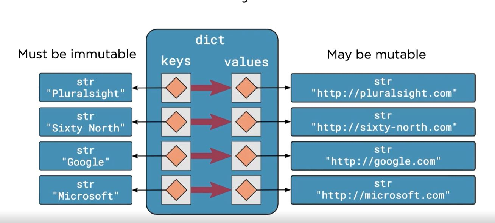
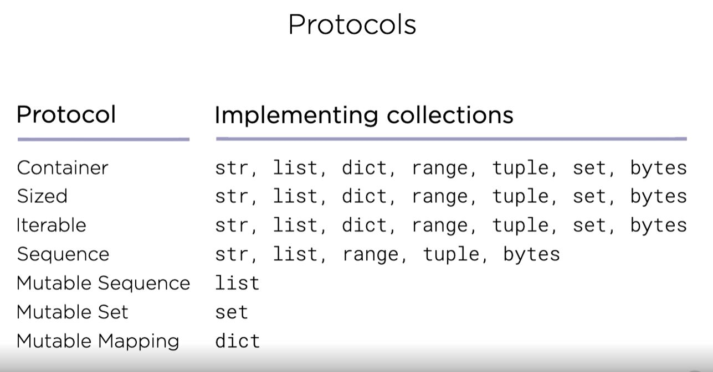
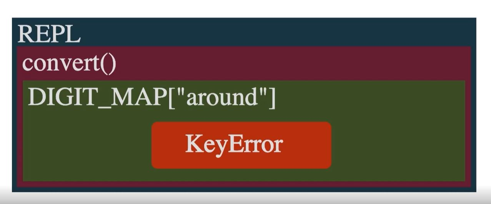

## Python Essential Training

   - Training the basics of the python based programming
   - REPL--> Read eval print loop
   - Python doesn't have variables in the sense of boxes holding a value
   - Python has named references to objects

### Scalar Types

   - int 42 - arbitrary precision integer
   - float 4.2 - 64-bit floating point numbers
   - None - the null object
   - bool True, False - boolean logical values


### Rational Operators

   - For value equal checks
   
### Conditional Statements

   - Branch execution based on the value of an expression

   ```python
      if expression:
         block
   ```
               
### Loops

   ```python
      while expression:
         block
   ```
   - break is supported
   
### Strings

 - Datatype : str
 - Sequence of Unicode code points
 - Immutable as in java
 - Supports single and multi line literals e.g.: '', ""
 - Concantenation of adjacent literals
 - Universal newlines
 - Raw Strings
 - Use str constructor to convert other types
 - Access individual characters with square bracket indexing
 - Rich API
 - Can contain unicode
 - Moment of Zen -> Practicality beats purity
   - Beautiful Text Strings
   - Rendered in the literal form
   - Simple elegance

### String Literals

 - Strings with Newlines
 
   - Use Multiline Strings: spread the literal across multiple lines
   - Escape Sequences: Embed escape sequences in a single-line literal

 - List of escape sequences

   

### Bytes

 - Date types for sequences of bytes
 - Raw binary data
 - Fixed-width single-byte encodings
 - literals prefixed with "b"
 - Use str.encode() and bytes.decod() for conversion

### Lists

 - Sequences of objects
 - Mutable, heterogeneous sequences
 - Delimited by [] brackets
 - Access elements with the square brackets
 - Elements can be replaced by assigning to an index
 - Grow list with the append()
 - Use list constructor to create lists from other sequences
 - A workhorse in python

### Dict

 - Fundamental data structure in python
 - Map key to values
 - Literals are limited by the curly braces
 - Seperted by commas
 - Keys are seperated by colon
 - Also known as maps or associative arrays
 
   ```python
      {k1: v1, k2: v2}
   ```

### for-loop

 - Visit item in an iterative sequence
 - Called as for each loops in other languages
  
  ```python
    for item in iterable:
      ...body...
  ```


### functions

 - def keyword used in the python for methods
 - Two between functions
 - That is the number of lines
 - PEP8 recommends
 - In the function args are transferred using pass-by-object-reference.
 - References to objects are copied, not the objects themselves.

### Naming special Functions
 
 - "__feature__" for indentifying
 - dunder:
   - Its a way of pronuncing special names
   - A portmanteau of "double underscore"
   - Instead of "underscore underscore name underscore underscore" its said "dunder name"


### Python Execution Model

 

### docstrings

 - Literal strings which document functions, modules and classes
 - They must be the first statement in the blocks for these constructs
 - seperted by """block"""
 - PEP257 
   - Official python convention for docstrings
   - But...not widely adopted

### Shebangs

 - #! is the keyword
 - e.g.:To make it executable: `chmod +x words_advanced.py`
      - Windows: `words_extract.py http://sixty-north.com/c/t.txt`
      - Linux: `./words_extract.py http://sixty-north.com/c/t.txt`


### Value vs. identity equality

 - Value-equality and identity equality are fundamentally different concepts.
 - Comparison by value can be controlled programmatically.


### Default Value Evaluation
 
 - Remember that def is a statement executed at runtime.
 - Default args are evaluated when def is executed.
 - Immutable default values don't cause problems.
 - Mutable default values can cause confusing effects.
 - Always use immutable objects for default values.

### Type Systems

 - It will not generally perform implicit conversation between types

 ### Scopes

  - Type declarations are unnecessary in python.
  - Names can be rebound as necessary to objects of any type.
  - Name resolution to objects is managed by scopes and scoping rules.
  - LEGB
      - Local -> Inside the current function
      - Enclosing -> Inside enclosing functions.
      - Global -> At the top level of the module.
      - Built-in -> In the special builtins module


### Scoping

 - Using the global names


### Built-In Collections

 - Tuples
   - Immutable sequences of arbitrary objects
   - Tuple unpacking is the destructuring operation that unpacks data structures into named references.
 - Strings
   - It is an immutable class
   - Use str.join() to join strings
      - Concantenation with + results in temporaries
      - str.join() inserts a seperator between a collection of strings
      - Call join() on the seperator string
   - PEP 498: Literal String Interpolation
      - Commonly called f-strings
      - Embed expressions inside literal strings, using a minimal syntax
 - Range
      - Signature
         - range(stop)
         - range(start, stop)
         - range(start, stop, step)
      - Range does not support keyword arguements.
   - Enumerate
      - Constructs an iterable of(index, value) tuples around another iterable object
 - Lists
      - Negative indices
         - Index from then end of sequences using negative numbers
         - The last element is at index -1
      - Slicing
         - Extended form of indexing for referring to a portion of a list or other sequence.
         - Syntax: a_list[start:stop]
      - list.index()
         - Find the location of an object in a list.
         - Returns the index of the first list element which is equal to the arguement
      - Delete
         - Remove an element from a list by index
         - Syntax: del a_list[index]
      - Insert
         - Insert an item into a list.
         - Accepts an item and the index of the new item.
      - Reverse
         - Reversing the elements
         - list.reverse()
      - Sorting
         - Sorts the elements
         - list.sort()
         - Can be any callable object that accepts a single parameter
         - Items passed to callable and sorted on its return value
 - Dict:
      - Key value storage

          
      
      - Do not rely on the order of the items
      - As with the lists dictionary copying is shallow
      - Update:
         - dict.update()
         - Add entries from one directory into another
         - Call this on the dictionary that is to be updated
      - Iteration
         - It yields the next day on each iteration
         - Values can be retrieved using the square-bracket operator
      - Each iterates over keys and values in tandem, dict.items()

 - Set
      - Unordored collection of unique elements.
      - Sets are mutable
      - Elements are set to be immutable
 - Protocol
      - It is a set of operations that a type must support to implement the protocol
      - Do not need to be defined as interfaces or base classes.
      - Types only need to provide functioning implementations.

         
      
      - Container: in , not in
      - Sized: len(container)
      - Iterable: Yields items one by one as they are requested
      - Sequence: 
         - Systax: item = sequence[index], i = sequence.index(item), num = sequence.count(item), r = reversed(sequence)
         - Supports iterable, sized, container


### Exceptions

- Exception propagation
   

- Exceptions resulting from programmer errors:
   - IndentationError
   - SyntaxError
   - NameError
- Programmer errrors should never be caught
- `pass` is a no-op
- Exceptions can not be ignored
   - Error codes are easy to ignore
   - Checks are always required
- It is part of an API
  - Use Standard exception types
    - Standard types-> It provides standard exceptions types for signalling common errors
    - Invalid arguement types-> Use ValueError for arguements of the right type but with an invalid value.
    - Exception Constructors-> Use raise ValueError() to raise a new ValueError
- Protocols
   - Sequences should raise IndexError for out-of-bounds indexing.
   - Exceptions must be implemented and documented correctly.
   - Existing built-in exceptions are often the right ones to use.
   - Follow existing patterns: The more your code follows established patterns, the easier it will be for others to use.
   - Common Exception types
      - IndexError: an integer index is out of range
      - ValueError: an object is of the correct type but has an appropriate value
      - KeyError: a loopup in the mapping failed
   - Avoid catching TypeError
      - Increase function resuability
      - Let Type Errors arise on their own
   - Its easier to ask forgiveness than permission
      - Prepare for failure
         - Check all preconditions
         - Prepare for consequences
         - `LBYL`- Look Before You Leap
         - `EAFP`- Easier to ask forgiveness then permission
         - EAFP is prefered because it put the code's "happy path" is emphasized rather than being interspered with error handling
         - EAFP is enabled by exceptions
         - Without exceptions, error handling is interspered in program flow
         - Exceptions can be handled non-locally
         - EAFP plus Exceptions
            - Exceptions are not easily ignored
            - Error codes are silent by default
            - Exceptions plus EAFP makes it hard for problems to be silently ignored
   - Clean up actions
      - Using the try, finally
   - Platform specific modules
      - For windows-use the `msvcrt` module
      - For linux-use tty, termios and sys modules
      - The caller can take alternative actions if both import fails, e.g: they could downgrade to user input()


### Iterations and Iterables

   - Comprehensions
      - Concise syntax for describing lists, sets and dictionaries
      - Readable and expressive
      - Close to natural language
      - Syntax: `[expr(item) for item in iterable]`
   - Dict Comprehensions
      - Syntax: 
         ```python
            {
               key_expr(item): value_expr(item)
               for item in iterable
            }
         ```
      - It don't work directly on dict sources
      - Use dict.items() to get keys and values from dict sources
      - Comprehension expressions can be arbitrarily complex
      - Avoid excessive complexity
   - Compresions should normally have no side-effects
   - Iteration Protocols
      - iterable: Can be passed to iter() to produce an iterator
      - iterator: Can be passed to next() to get the next value in the sequence
      - Stopping iteration with an exception
         - A single end: Sequences only have on ending, after all, so reaching it is exceptional
         - Infinite sequences: Finding the end of an infinite sequence
   - Generator Functions
      - Iterables defined by functions
      - Lazy evaluation
      - Can model sequences with no definie end
      - Composable into pipelines
      - Uses the yield keyword-> generator functions must include at least one yield statement and also should include return statements.
      - Maintaining state in the generators
         - Control flow is easier to see in a graphical debugger
      - Generators only do enough work to produce requested data
      - This allows generators to model infinite(or just very large) sequences
      - E.g., Sensor readings, Mathematical Sequences, Contents of large files 
      - To recreate a generator expression, you must execute the expression again
   - Iteration tools provide a powerful vocabulary for working with iterators
      - These include the familiar enumerate() and sum()
      - The iterator module provides many more
      - itertools.islice() -> perform lazy slicing of any iterators
      - itertools.count() -> an unbounded arithmetic sequence of intergers
      - Boolean Aggregation
         - any() -> determines if any elements in a series are true
         - all() -> determinse if all elements in a series are true
      - Zip -> Synchronize iterations across two or more iterables


### Classes

   - Define the structure and behavior of objects
   - Act as a template for creating an object
   - Classes control an object's intial state, attributes and methods
   - They can make complex problems tractable
   - Helps in OOP's
   - Can make simple problems unnecessarily complex
   - Python lets you strike the right balance between functions and classes
   - __init__()-> instance method for initializing new objects
   - Class invariants-> truth about an object that endures for its lifetime
   - Law of Demeter
      - The principle of the least knowledge
      - Only talk to your friends
   - Tell! Dont Ask: Tell other objects what to do instead of asking them their state and responding to it
   - Polymorphism
      - Using objects of different types through a uniform interface
      - It applies to both functions as well as more complex types
      - Duck typing
   - Inheritance
      - Nominally-typed languages use inheritance for polymorphism
      - Python use late binding
      - You can try any method on any object
      - Inheritance in python is primarily useful for sharing implementation between classes
      