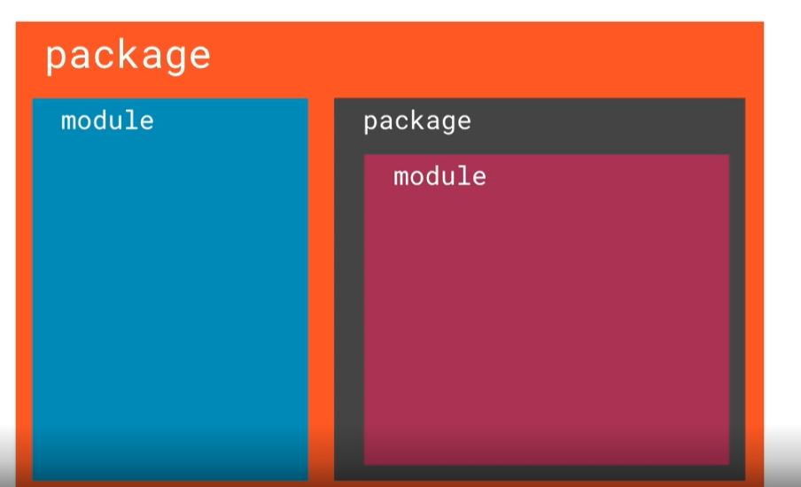
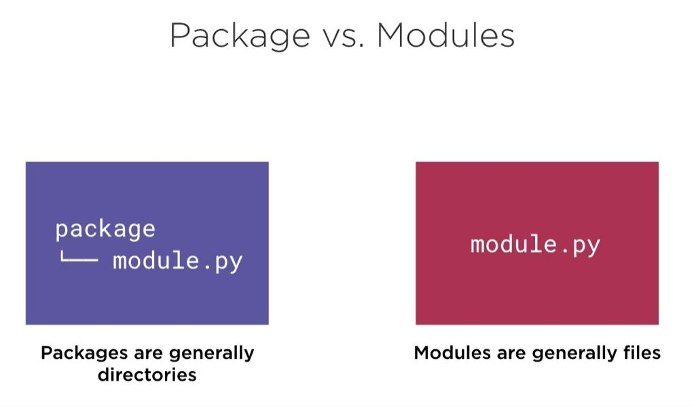
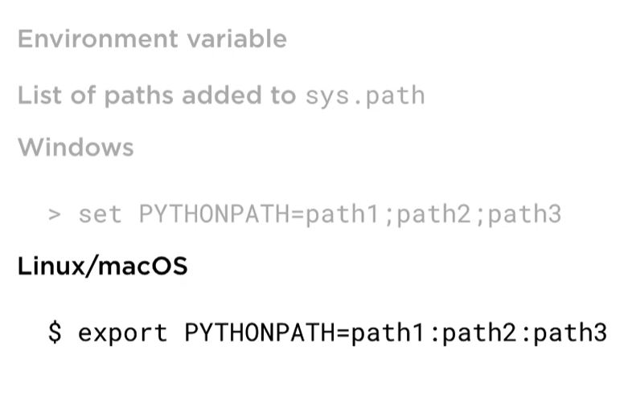
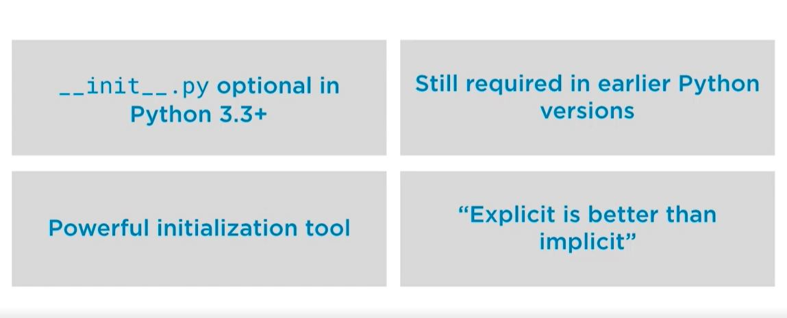

# Python Manage Complex Packages

 - Basic syntax
      ```python
        import x
        from x import y
        from x import y as z
      ```
 - Temminology for special methods: __<<method>>__
 - Method:
      - Python's basic tool for organizing code
      - Normally a single python source file
      - Load modules with `import`
      - Represent by module objects

## Structure details

   

## Packages Vs Modules

   


## Locating modules

   - Uses the sys.path
      - Searches for the list of directories
      - Searched in order in import
      - First match provides module
      - ImportError where there is no match found
   - PythonPath-> export PYTHONPATH='absolute-path-url'
       
       

## PEP420 and __init__.py

   


### Project MultiReader:

   - Read uncompressed text files
   - Read gzip-compressed files
   - Read bz2-compressed files