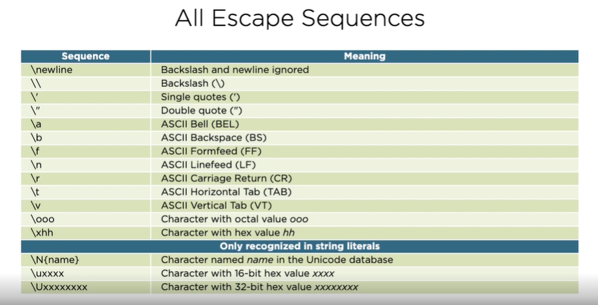
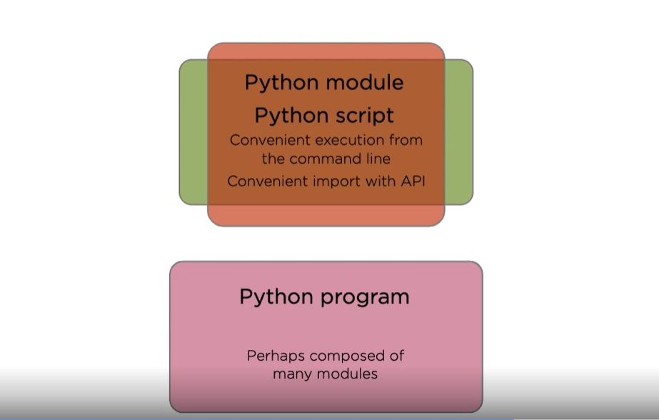

## Python Essential Training

   - Training the basics of the python based programming
   - REPL--> Read eval print loop
   - Python doesn't have variables in the sense of boxes holding a value
   - Python has named references to objects

### Scalar Types

   - int 42 - arbitrary precision integer
   - float 4.2 - 64-bit floating point numbers
   - None - the null object
   - bool True, False - boolean logical values


### Rational Operators

   - For value equal checks
   
### Conditional Statements

   - Branch execution based on the value of an expression

   ```python
      if expression:
         block
   ```
               
### Loops

   ```python
      while expression:
         block
   ```
   - break is supported
   
### Strings

 - Datatype : str
 - Sequence of Unicode code points
 - Immutable as in java
 - Supports single and multi line literals e.g.: '', ""
 - Concantenation of adjacent literals
 - Universal newlines
 - Raw Strings
 - Use str constructor to convert other types
 - Access individual characters with square bracket indexing
 - Rich API
 - Can contain unicode
 - Moment of Zen -> Practicality beats purity
   - Beautiful Text Strings
   - Rendered in the literal form
   - Simple elegance

### String Literals

 - Strings with Newlines
 
   - Use Multiline Strings: spread the literal across multiple lines
   - Escape Sequences: Embed escape sequences in a single-line literal

 - List of escape sequences

   

### Bytes

 - Date types for sequences of bytes
 - Raw binary data
 - Fixed-width single-byte encodings
 - literals prefixed with "b"
 - Use str.encode() and bytes.decod() for conversion

### Lists

 - Sequences of objects
 - Mutable, heterogeneous sequences
 - Delimited by [] brackets
 - Access elements with the square brackets
 - Elements can be replaced by assigning to an index
 - Grow list with the append()
 - Use list constructor to create lists from other sequences
 - A workhorse in python

 ### Dict

 - Fundamental data structure in python
 - Map key to values
 - Literals are limited by the curly braces
 - Seperted by commas
 - Keys are seperated by colon
 - Also known as maps or associative arrays
 
   ```python
      {k1: v1, k2: v2}
   ```

### for-loop

 - Visit item in an iterative sequence
 - Called as for each loops in other languages
  
  ```python
    for item in iterable:
      ...body...
  ```


### functions

 - def keyword used in the python for methods
 - Two between functions
 - That is the number of lines
 - PEP8 recommends
 - In the function args are transferred using pass-by-object-reference.
 - References to objects are copied, not the objects themselves.

### Naming special Functions
 
 - "__feature__" for indentifying
 - dunder:
   - Its a way of pronuncing special names
   - A portmanteau of "double underscore"
   - Instead of "underscore underscore name underscore underscore" its said "dunder name"


### Python Execution Model

 

### docstrings

 - Literal strings which document functions, modules and classes
 - They must be the first statement in the blocks for these constructs
 - seperted by """block"""
 - PEP257 
   - Official python convention for docstrings
   - But...not widely adopted

### Shebangs

 - #! is the keyword
 - e.g.:
 - To make it executable: `chmod +x words_advanced.py`
   - Windows: `words_extract.py http://sixty-north.com/c/t.txt`
   - Linux: `./words_extract.py http://sixty-north.com/c/t.txt`


### Value vs. identity equality

 - Value-equality and identity equality are fundamentally different concepts.
 - Comparison by value can be controlled programmatically.


### Default Value Evaluation
 
 - Remember that def is a statement executed at runtime.
 - Default args are evaluated when def is executed.
 - Immutable default values don't cause problems.
 - Mutable default values can cause confusing effects.
 - Always use immutable objects for default values.

### Type Systems

 - It will not generally perform implicit conversation between types

 ### Scopes

  - Type declarations are unnecessary in python.
  - Names can be rebound as necessary to objects of any type.
  - Name resolution to objects is managed by scopes and scoping rules.
  - LEGB
      - Local -> Inside the current function
      - Enclosing -> Inside enclosing functions.
      - Global -> At the top level of the module.
      - Built-in -> In the special builtins module


### Scoping

 - Using the global names


### Built-In Collections

 - Tuples
   - Immutable sequences of arbitrary objects
   - Tuple unpacking is the destructuring operation that unpacks data structures into named references.
 - Strings
   - It is an immutable class
   - Use str.join() to join strings
      - Concantenation with + results in temporaries
      - str.join() inserts a seperator between a collection of strings
      - Call join() on the seperator string
   - PEP 498: Literal String Interpolation
      - Commonly called f-strings
      - Embed expressions inside literal strings, using a minimal syntax
 - Range
      - Signature
         - range(stop)
         - range(start, stop)
         - range(start, stop, step)
