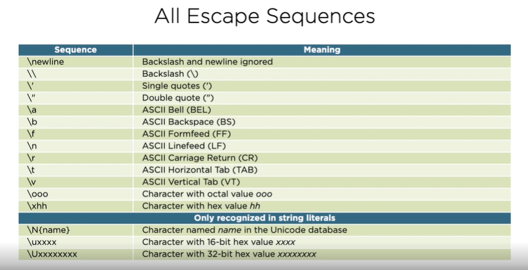

## Python Essential Training

   - Training the basics of the python based programming

### Scalar Types

   - int 42 - arbitrary precision integer
   - float 4.2 - 64-bit floating point numbers
   - None - the null object
   - bool True, False - boolean logical values


### Rational Operators

   - For value equal checks
   
### Conditional Statements

   - Branch execution based on the value of an expression

   ```python
      if expression:
         block
   ```
               
### Loops

   ```python
         while expression:
            block
   ```
   - break is supported
   
   
### Strings

 - Datatype : str
 - Sequence of Unicode code points
 - Immutable as in java
 - Supports single and double quotes '', ""
 - Moment of Zen -> Practicality beats purity
   - Beautiful Text Strings
   - Rendered in the literal form
   - Simple elegance


### String Literals

 - Strings with Newlines
 
   - Use Multiline Strings: spread the literal across multiple lines
   - Escape Sequences: Embed escape sequences in a single-line literal

 - List of escape sequences

   
 

